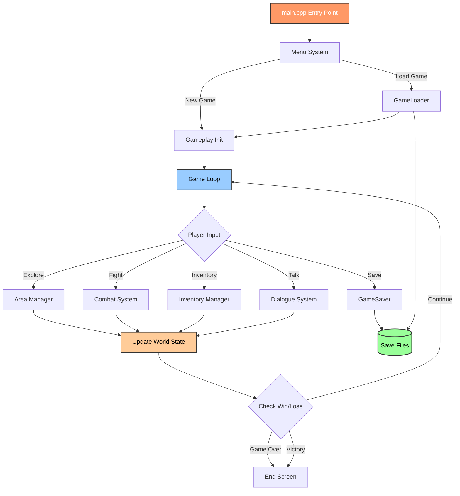

<div align="center">

  

  # ⚔️ Eternal of Empire

  **Tekstowa gra RPG w C++ z dynamicznym systemem zapisu/wczytywania**
  <br>
  *Konsolowa przygoda RPG napisana w C++17 przy użyciu Visual Studio*

  <p>
    <a href="https://github.com/MaxPowerPL/eternal-of-empire/tags">
      
    </a>
    <a href="#">
      
    </a>
    <a href="https://isocpp.org/">
      
    </a>
    <a href="https://visualstudio.microsoft.com/">
      
    </a>
    <a href="https://github.com/MaxPowerPL/eternal-of-empire/stargazers">
      
    </a>
    <a href="https://github.com/MaxPowerPL/eternal-of-empire">
      
    </a>
    <a href="LICENSE">
      
    </a>
  </p>

  <p>
    <a href="#-o-projekcie">📖 O Projekcie</a> •
    <a href="#-funkcjonalności">✨ Funkcjonalności</a> •
    <a href="#-instalacja-i-uruchomienie">🚀 Instalacja</a> •
    <a href="#-struktura-projektu">📂 Struktura</a> •
    <a href="#%EF%B8%8F-roadmapa">🗺️ Roadmapa</a>
  </p>
</div>

---

## 📖 O Projekcie

**Eternal of Empire** to tekstowa gra RPG osadzona w fantasy uniwersum, stworzona w języku C++ przy użyciu Visual Studio. Projekt skupia się na zasadach programowania obiektowego (OOP), zarządzaniu plikami oraz interaktywnej narracji sterowanej wyborami gracza. Gra oferuje dynamiczny system walki, zarządzanie ekwipunkiem oraz rozbudowany system save/load pozwalający zapisywać postępy w pliku tekstowym.

Projekt powstał jako demonstracja zaawansowanych technik programowania w C++17, wykorzystując wzorce projektowe, obsługę plików binarnych i nowoczesne standardy języka. Inspiracją były klasyczne tekstowe RPG-i oraz chęć stworzenia rozszerzalnego silnika gry, który można łatwo modyfikować i dostosowywać do własnych potrzeb.

### 🎯 Aktualna Wersja: `v0.1.0-alpha (Early Development)`
Wersja alfa wprowadza podstawowy gameplay loop: tworzenie postaci, eksplorację lokacji, system walki turowej oraz mechanizm zapisywania/wczytywania stanu gry. Projekt jest aktywnie rozwijany - planowane są nowe lokacje, quest system oraz rozbudowana fabuła.

---

## ✨ Funkcjonalności

Co już działa w tej wersji?

- [x] **⚔️ System Walki**:
  - **Walka turowa**: Wybieranie ataków, obrony lub użycia przedmiotów.
  - **Kalkulacja obrażeń**: Dynamiczne obliczanie damage'u bazujące na statystykach postaci.
  - **AI przeciwników**: Prosta logika decyzyjna dla wrogów.
- [x] **🎒 Zarządzanie Ekwipunkiem**:
  - **Inventory system**: Zbieranie, używanie i upuszczanie przedmiotów.
  - **Statystyki itemów**: Broń, zbroje i mikstury z różnymi parametrami.
  - **Limit ekwipunku**: Maksymalna liczba przedmiotów w plecaku.
- [x] **💾 System Zapisu/Wczytywania**:
  - **Zapis do pliku**: Serializacja stanu gry do formatu tekstowego/binarnego.
  - **Wczytywanie gry**: Przywracanie postaci, lokacji i postępów.
  - **Multiple save slots**: Możliwość tworzenia wielu zapisów (planowane).
- [x] **📜 Interaktywna Fabuła**:
  - **Wybory gracza**: Decyzje wpływające na przebieg historii.
  - **Dialogi z NPC**: Rozmowy z postaciami niezależnymi.
  - **Eksploracja świata**: Poruszanie się między lokacjami.
- [ ] **🗺️ Quest System** (W przygotowaniu):
  - **Zadania fabularne**: Strukturalny system questów z nagrodami.
  - **Journal**: Dziennik śledzący aktywne i ukończone misje.

---

## 🛠️ Technologie

Projekt został zbudowany przy użyciu:

| Technologia | Opis |
| :--- | :--- |
| **C++17** | Nowoczesny standard C++ z `std::optional`, `std::variant`, structured bindings. |
| **Visual Studio 2022** | Główne IDE z obsługą debuggera, IntelliSense i MSBuild. |
| **STL (Standard Library)** | Kontenery (`std::vector`, `std::map`), file I/O (`std::fstream`), algorytmy. |
| **OOP Design Patterns** | Factory, Singleton, Observer dla architektury gry. |

---

## 🚀 Instalacja i Uruchomienie

Aby uruchomić projekt na swoim komputerze, wykonaj następujące kroki:

### 1. Wymagania
- **Windows 10/11** (64-bit)
- **Visual Studio 2019/2022** z zainstalowanym workloadem "Desktop development with C++"
- **C++17 Compiler** (MSVC v143 lub nowszy)

### 2. Klonowanie repozytorium
```bash
git clone https://github.com/MaxPowerPL/eternal-of-empire.git
cd eternal-of-empire
```

### 3. Konfiguracja środowiska

**Windows (Visual Studio):**
1. Otwórz plik `Eternal of Empire.sln` w Visual Studio
2. Wybierz konfigurację: `Debug` lub `Release`
3. Upewnij się, że platforma to `x64` lub `x86`
4. Visual Studio automatycznie skonfiguruje projekt

### 4. Kompilacja
**W Visual Studio:**
- Naciśnij `Ctrl+Shift+B` lub kliknij `Build` → `Build Solution`
- Sprawdź Output window pod kątem błędów kompilacji

**Z linii poleceń (MSBuild):**
```bash
msbuild "Eternal of Empire.sln" /p:Configuration=Release /p:Platform=x64
```

### 5. Uruchomienie
**Z Visual Studio:**
- Naciśnij `F5` (uruchomienie z debuggerem) lub `Ctrl+F5` (bez debuggera)

**Z Explorera:**
- Przejdź do `x64/Debug/` lub `x64/Release/`
- Uruchom plik `Eternal of Empire.exe`

### 6. Sterowanie
- **Wpisywanie komend**: Gra bazuje na tekstowych poleceniach i wyborze opcji numerycznych
- **Nawigacja**: Użyj `1`, `2`, `3` do wybierania opcji z menu
- **Wyjście**: Wpisz `exit` lub `quit` aby zakończyć grę
- **Pomoc**: Komenda `help` wyświetla listę dostępnych poleceń

---

## 📂 Struktura Projektu

Projekt wykorzystuje modularną architekturę zgodną z hierarchią Visual Studio:

```text
📦 ETERNAL-OF-EMPIRE/
┣ 📂 Eternal of Empire/                   # Główny folder projektu VS
┃ ┣ 📂 data/                              # Dane gry
┃ ┃ ┣ 📂 klasy/                           # Definicje klas postaci
┃ ┃ ┃ ┣ 📂 miasto/                        # Lokacje miejskie (W przyszłości)
┃ ┃ ┃ ┣ 📜 Area.cpp                       # Implementacja systemu lokacji
┃ ┃ ┃ ┣ 📜 DataUtils.cpp                  # Narzędzia do parsowania danych
┃ ┃ ┃ ┣ 📜 Dialogue.cpp                   # System dialogów z NPC
┃ ┃ ┃ ┣ 📜 GameLoader.cpp                 # Wczytywanie stanu gry
┃ ┃ ┃ ┣ 📜 Gameplay.cpp                   # Główna logika rozgrywki
┃ ┃ ┃ ┣ 📜 GameSaver.cpp                  # Zapis stanu gry
┃ ┃ ┃ ┗ 📜 Menu.cpp                       # System menu głównego
┃ ┃ ┣ 📂 nagłówki/                        # Pliki nagłówkowe (.h)
┃ ┃ ┃ ┣ 📂 miasto/                        # (W przyszłości)
┃ ┃ ┃ ┣ 📜 Area.h                         # Deklaracje klas lokacji
┃ ┃ ┃ ┣ 📜 DataUtils.h                    # Utility headers
┃ ┃ ┃ ┣ 📜 Dialogue.h                     # Dialog system headers
┃ ┃ ┃ ┣ 📜 GameLoader.h                   # Save loader headers
┃ ┃ ┃ ┣ 📜 Gameplay.h                     # Core gameplay headers
┃ ┃ ┃ ┣ 📜 GameSaver.h                    # Save system headers
┃ ┃ ┃ ┣ 📜 Inventory.h                    # Inventory management
┃ ┃ ┃ ┗ 📜 Menu.h                         # Menu headers
┃ ┃ ┗ 📂 zasoby/                          # Zasoby projektu
┃ ┃   ┣ 📜 ikona.ico                      # Ikona aplikacji
┃ ┃   ┣ 📜 resource.o                     # Skompilowany resource
┃ ┃   ┗ 📜 resource.rc                    # Resource script
┃ ┣ 📜 Eternal of Empire.vcxproj          # Plik projektu VS
┃ ┣ 📜 Eternal of Empire.vcxproj.filters  # Filtry projektu
┃ ┗ 📜 main.cpp                           # Entry point aplikacji
┣ 📜 .gitignore                           # Ignorowane pliki
┣ 📜 Eternal of Empire.sln                # Visual Studio Solution
┣ 📜 LICENSE                              # Własna licencja proprietary
┗ 📜 README.md
```

### Opis głównych modułów:

#### `data/klasy/miasto/` (Implementacje)
| Plik | Opis |
|------|------|
| `Area.cpp` | Zarządzanie lokacjami - wejścia/wyjścia, opisy, interakcje. |
| `DataUtils.cpp` | Parsowanie plików konfiguracyjnych, utility functions. |
| `Dialogue.cpp` | System konwersacji z NPC - drzewo dialogowe, branching. |
| `GameLoader.cpp` | Deserializacja zapisów gry z plików binarnych/tekstowych. |
| `Gameplay.cpp` | Główna pętla gry, obsługa input/output, state machine. |
| `GameSaver.cpp` | Serializacja stanu gry - postać, ekwipunek, progres. |
| `Menu.cpp` | Menu główne - nowa gra, wczytaj, opcje, credits. |

#### `data/nagłówki/miasto/` (Deklaracje)
| Plik | Opis |
|------|------|
| `Area.h` | Forward declarations dla klas lokacji. |
| `Gameplay.h` | Core gameplay interfaces i enums. |
| `Inventory.h` | System ekwipunku - klasa Item, pojemność, sortowanie. |
| `*.h` | Pozostałe headers odpowiadające plikom .cpp. |

---

## ⚙️ Architektura Systemu Gry

### Diagram Przepływu Danych (Mermaid):



### Kluczowe wzorce projektowe:
- **Singleton**: `GameState` - globalny stan gry dostępny wszędzie
- **Factory**: `ItemFactory::createItem(type)` dla generowania przedmiotów
- **Observer**: Event system dla powiadomień (damage taken, level up)
- **State Machine**: `GameplayState` (menu/explore/combat/dialogue)

---

## 🗺️ Roadmapa

Plany rozwoju projektu:

### Faza 1: Core Gameplay ✅ (Ukończone)
- [x] Implementacja podstawowej pętli gry (game loop)
- [x] System walki turowej z kalkulacją obrażeń
- [x] Zarządzanie ekwipunkiem i statystykami gracza
- [x] Save/Load system (serializacja do pliku)

### Faza 2: Content Expansion 🚧 (W trakcie)
- [ ] Rozbudowa systemu lokacji (10+ unikalnych miejsc)
- [ ] Quest system z branching storyline
- [ ] Crafting system (łączenie przedmiotów)
- [ ] Sklepy i ekonomia (kupno/sprzedaż itemów)
- [ ] Skill tree (rozwój umiejętności postaci)

### Faza 3: Polish & Features 📋 (Planowane)
- [ ] Multiplayer (2-player co-op przez sieć)
- [ ] Proceduralne generowanie dungeonów
- [ ] ASCII art dla ważnych scenek
- [ ] Sound effects (Windows API audio)
- [ ] Modding support (ładowanie custom content)

---

## 🐛 Znane Problemy i Rozwiązania

### ✅ Naprawione w v0.1.0-alpha:
- **Memory leak w ItemFactory**: Dodano `std::shared_ptr` dla automatycznego zarządzania pamięcią.
- **Crash przy pustym ekwipunku**: Walidacja indeksów przed dostępem do wektora.
- **Niepoprawny zapis statystyk**: Naprawiono kolejność serializacji w `GameSaver::saveGame()`.

### 🔧 Do poprawy:
- [ ] Brak obsługi polskich znaków w konsoli (encoding problem)
- [ ] Long combat sequences nie są skip'owalne
- [ ] Save file nie ma checksumów (brak ochrony przed modyfikacją)
- [ ] AI przeciwników jest zbyt predyktywne (potrzeba randomizacji)

---

## 📝 Changelog

### v0.1.0-alpha (Current - Early Access)
**NEW FEATURES:**
- Podstawowy system walki turowej z 3 typami ataków
- Zarządzanie ekwipunkiem (do 20 slotów)
- Save/Load przez pliki tekstowe (`zapisy/savegame.txt`)
- 5 początkowych lokacji do eksploracji
- 10 różnych typów przedmiotów (bronie, zbroje, mikstury)

**Zmiany techniczne:**
- Użycie C++17 features (structured bindings, `std::optional`)
- Refactoring do modularnej struktury (data/klasy, data/nagłówki)
- Dodanie Visual Studio solution (.sln, .vcxproj)

---

## 📜 Licencja

Ten projekt jest objęty **Własną Licencją Zastrzeżoną (Custom Proprietary License)**.

### ✅ Co MOŻESZ robić:
- **Przeglądać i studiować** kod źródłowy w celach edukacyjnych
- **Pobrać i uruchomić** grę do użytku osobistego, niekomercyjnego
- **Umieścić** ten projekt w swoim portfolio lub CV
- **Rekruterzy** mogą przeglądać i testować kod podczas procesów rekrutacyjnych

### ❌ Czego NIE MOŻESZ robić bez zgody:
- Używać tego kodu komercyjnie lub w płatnych projektach
- Publikować lub dystrybuować zmodyfikowane wersje
- Umieszczać ten kod w innych publicznych repozytoriach
- Używać fragmentów kodu w aplikacjach komercyjnych

### 💼 Użytek komercyjny
Jeśli chcesz użyć tego oprogramowania komercyjnie lub opublikować modyfikacje, skontaktuj się ze mną:
**dominik.kielczewski@gmail.com**

Zobacz pełne warunki prawne w pliku [LICENSE](LICENSE).

---

<div align="center">

### ⭐ Jeśli podoba Ci się ten projekt, zostaw gwiazdkę na GitHubie! ⭐

☕ Stworzono używając C++17, Visual Studio i pasji do klasycznych RPG-ów.
<br>
<sub>Projekt edukacyjny demonstrujący zaawansowane techniki OOP w C++ oraz zarządzanie złożonym stanem gry.</sub>
<br>
<sub>**Custom Proprietary License** - Kod dostępny do wglądu, użytek komercyjny wymaga zgody. Zobacz [LICENSE](LICENSE) po szczegóły.</sub>

<p>
  <a href="https://github.com/MaxPowerPL/eternal-of-empire/issues/new">🐛 Zgłoś Bug</a> •
  <a href="https://github.com/MaxPowerPL/eternal-of-empire/issues/new">💡 Zaproponuj Funkcję</a> •
  <a href="mailto:dominik.kielczewski@gmail.com">📧 Kontakt ws. licencji</a>
</p>


</div>
